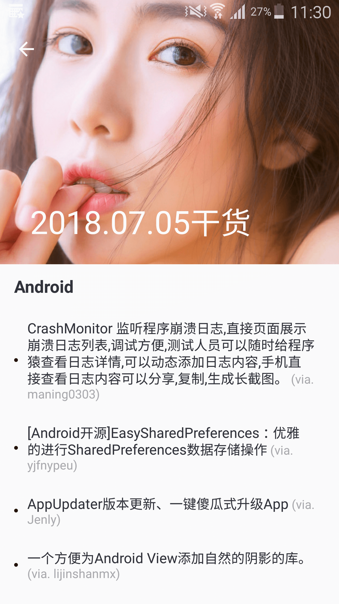
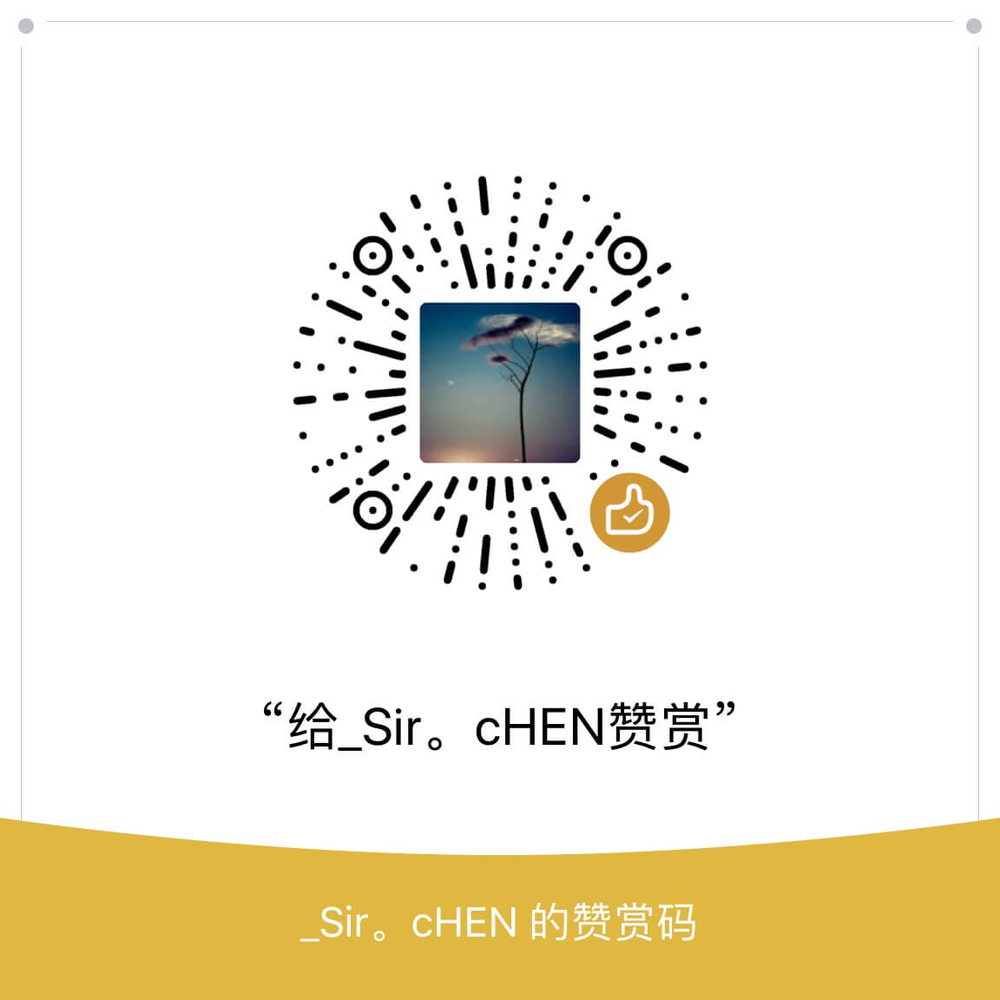

## GGank干货集中营

GGank是干货集中营非官方Android 客户端。每天一张精选妹纸图，一个休息视频以及若干Android、iOS、前端方面的精选技术文章。App使用RxJava2、Retrofit 和Glide 框架等等。这也是本人的练手之作，追求代码优雅、质量和Android最佳实践。 

### 应用截图：

  
  

### 数据来源：

 本应用所有数据均来自[干货集中营](http://gank.io/)的开放API。

### 计划：

应用目前为1.0.0版本，整体功能不算复杂。未来会使用MVP架构进行重构，优化代码，进一步完善功能和体验，慢慢加入[Android Architecture Components](https://developer.android.com/topic/libraries/architecture/)以及其他Google官方组件的实践。

### 期待：

- 如果您在使用过程中发现Bug或者觉得有何不合适，欢迎提交issues。
- 如果你查看项目源码觉得有可以优化的地方，或者对某种交互、特效有更好的实现方式，欢迎提交issues。

### 感谢：

- [@代码家](https://github.com/daimajia)
- [@drakeet](https://github.com/drakeet)   [Meizhi App](https://github.com/drakeet/Meizhi) 

### 关于我：

- 四川，成都。Android开发工程师。
- 邮箱：sir.chen93@gmail.com ，欢迎互相交流。
- 微信：MTg5ODA5NTcwNTc=（Base64）

### 鼓励与打赏：

如果你觉得我的项目对你有帮助，可以分享给你的朋友，或者请我喝一杯星巴克QAQ。请扫描下方的二维码随意打赏，您的支持是我最好的动力! 



### License

```
Copyright (c) 2018 ChenSir

Licensed under the Apache License, Version 2.0 (the "License");
you may not use this file except in compliance with the License.
You may obtain a copy of the License at

    http://www.apache.org/licenses/LICENSE-2.0

Unless required by applicable law or agreed to in writing, software
distributed under the License is distributed on an "AS IS" BASIS,
WITHOUT WARRANTIES OR CONDITIONS OF ANY KIND, either express or implied.
See the License for the specific language governing permissions and
limitations under the License.
```